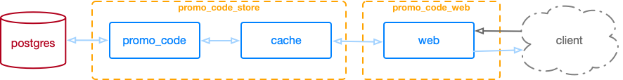

# SafeBoda technical challenge

## Introduction

This project contains a [Elixir](https://elixir-lang.org/)
[umbrella](https://elixir-lang.org/getting-started/mix-otp/dependencies-and-umbrella-projects.html)
that solves a [SafeBoda](https://safeboda.com/ug/) challenge.

## Challenge

### Description

SafeBoda want to give out promo codes worth x amount during events so people can
get free rides to and from the event. The flaw with that is people can use the
promo codes without going for the event.

### Features

* Generation of new promo codes for events
* The promo code is worth a specific amount of ride
* The promo code can expire
* Can be deactivated
* Return active promo codes
* Return all promo codes
* Only valid when user’s pickup or destination is within x radius of the event venue
* The promo code radius should be configurable
* To test the validity of the promo code, expose an endpoint that accept origin, destination, the promo code. The api should return the promo code details and a polyline using the destination and origin if promo code is valid and an error otherwise.

## Prepare your system

This project uses [asdf](https://github.com/asdf-vm/asdf) for tool version
managing. In order to get your system ready you must:

* [Install asdf](https://github.com/asdf-vm/asdf#setup)
* Install the necessary plugins for this project:
  * Erlang: `asdf plugin-add erlang`
  * Elixir: `asdf plugin-add elixir`
* Install project local versions: `asdf install`

## Architecture

The project contains three main applications:

* `promo_code`: Business logic for promo codes.
* `promo_code_web`: Contains the HTTP server and provides the interface and
    endpoints to interact with the backend.
* `promo_code_store`: Application that contains the model and persists and caches the data.

The following diagram shows the flow of the architecture:

